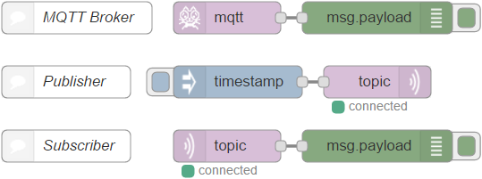

# node-red-contrib-mqtt-broker
MQTT Broker server on Node-RED

Because this MQTT broker is implemented by Node.js, you can test MQTT-in and MQTT-out nodes without MQTT environment like Mosquitto.

## Flows
Once you just put this node on Node-RED and hit deploy button, MQTT Broker will run on your Node-RED.



## Install
Run the following npm command in your Node-RED environment.
```
npm install -g node-red-contrib-mqtt-broker
```

## Original project
To register Node-RED library, README.md was added from [node-red-contrib-mosca](https://github.com/mapero/node-red-contrib-mosca) project.
